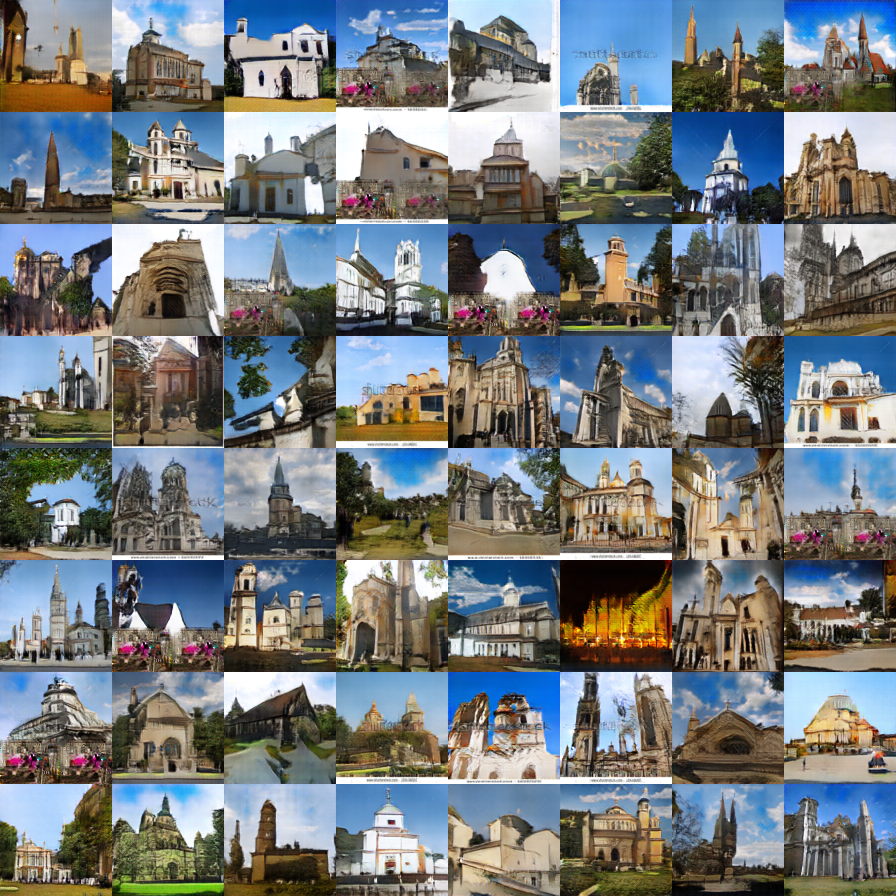
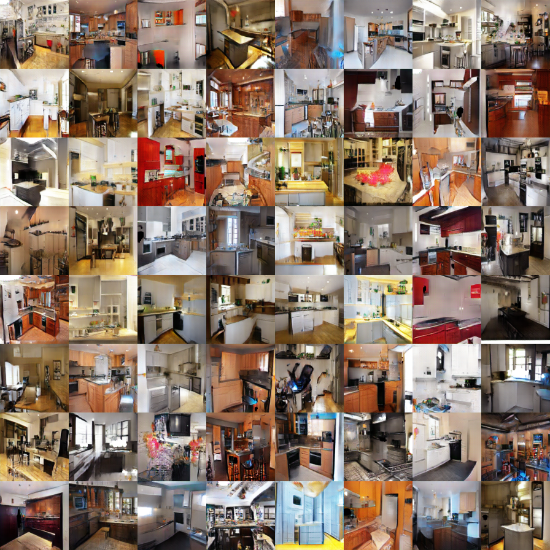
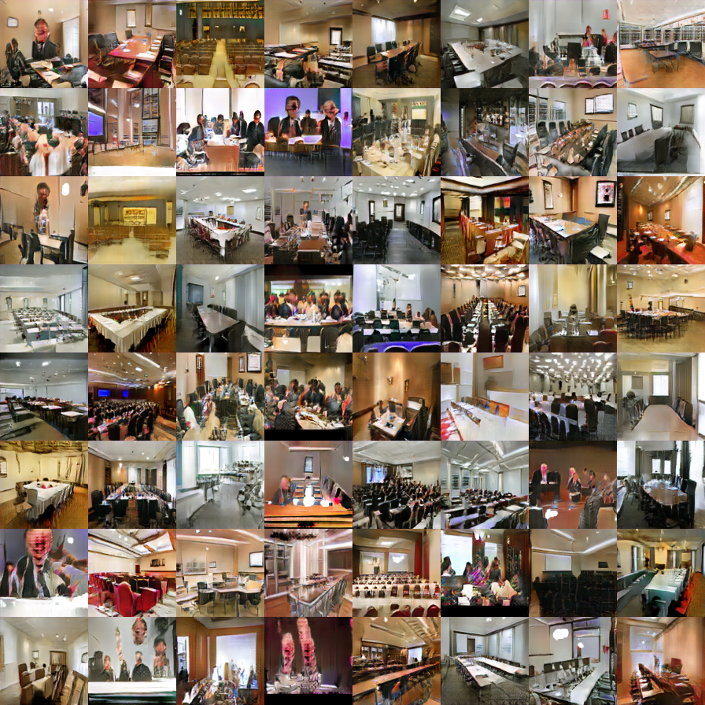
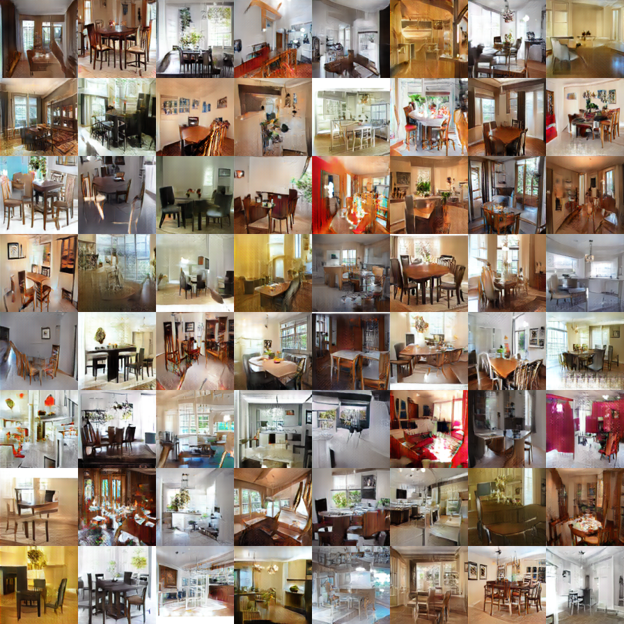

# LSGAN
### Prerequisites
- [Tensorflow r0.12](https://www.tensorflow.org/versions/r0.12/get_started/os_setup)
- SciPy

### Usage
1.Download datasets
  - [LSUN](http://lsun.cs.princeton.edu/2016/)
  - [HWDB1.0 (Handwritten Chinese characters)](http://www.nlpr.ia.ac.cn/databases/handwriting/Download.html)

2.Convert data

```
  $ python convert_lsun.py --source_dir $SOURCE_PATH --target_dir $TARGET_PATH
  $ python convert_icdar.py --source_dir $SOURCE_PATH --target_dir $TARGET_PATH
```

3.Train model

```
  $ python train_lsun.py --data_path $DATA_PATH
  $ python train_chn.py --data_dir $DATA_DIR
```

### Citation
If you use this work in your research, please cite:

    @article{arxiv1611.04076,
      author = {Xudong Mao, Qing Li, Haoran Xie, Raymond Y.K. Lau and Zhen Wang and Stephen Paul Smolley},
      title = {Least Squares Generative Adversarial Networks},
      journal = {arXiv preprint arXiv:1611.04076},
      year = {2016}
    }
    
 
### Results
#### Church
 
#### Bedroom
 
#### Kitchen
 
#### Conference
 
#### Dining
 
